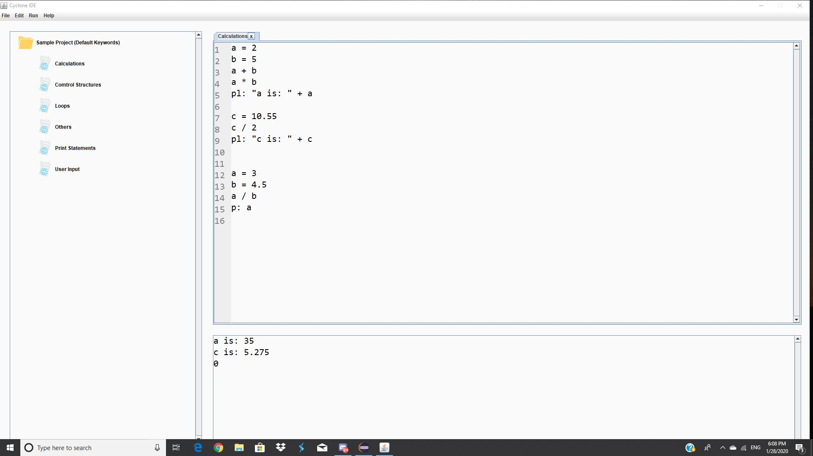
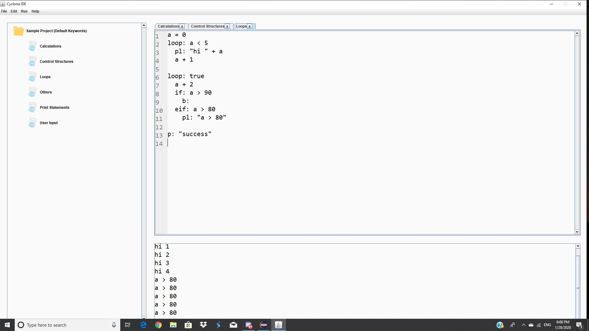
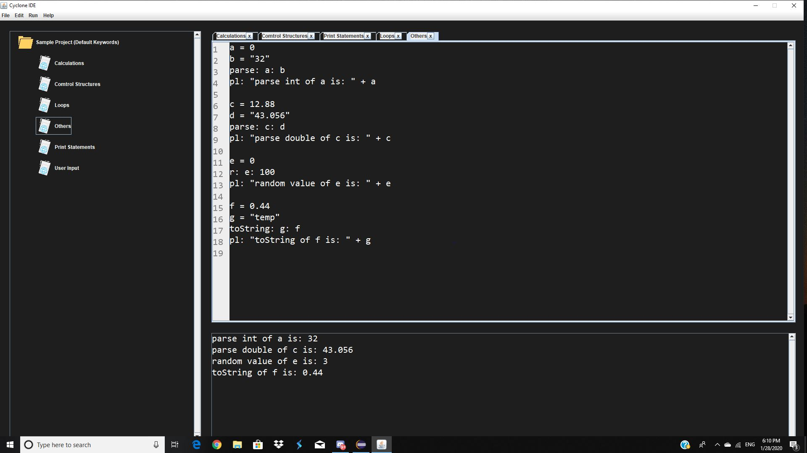
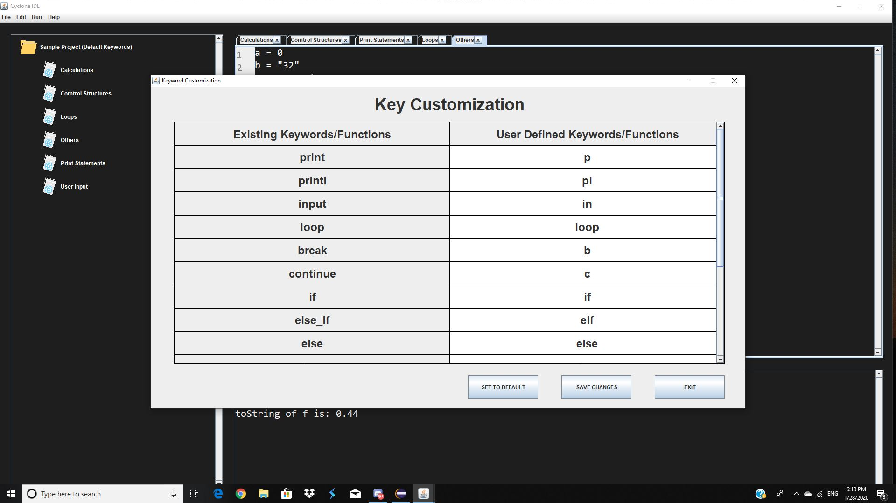
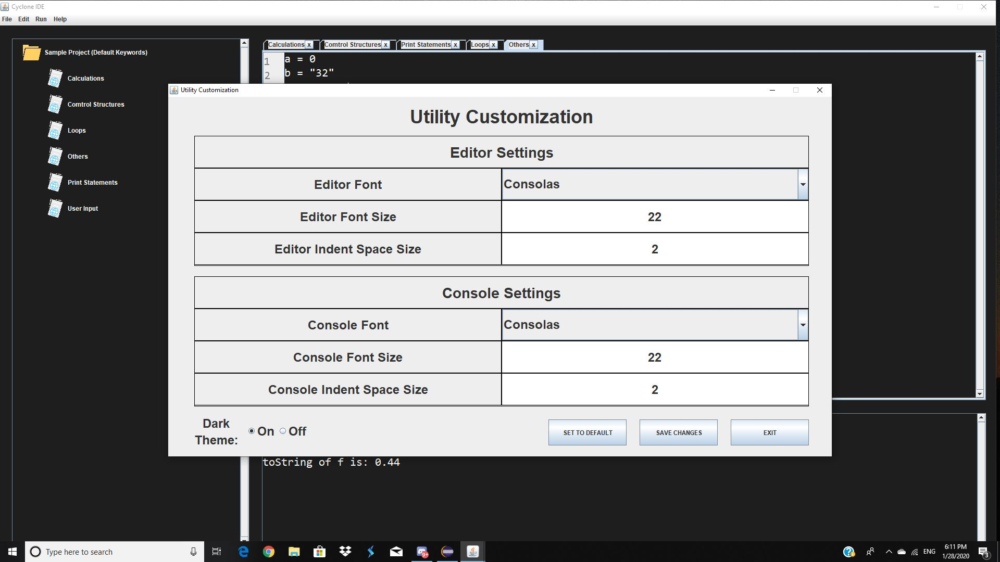

# Cyclone-IDE
Cyclone is an integrated development environment that will allow users to program using a new programming language that we will be creating.  This new language will use simpler keywords and to substitute for Java’s keywords.  Additionally, this new language will follow the convention of using tab spaces to indicate that several lines are a part of a block of code.  The application will have a text area in which the user will enter their code, an area in which files project folders and files will be displayed, and a text area for the console.  To run a program, the application will convert the code written in our new programming language to Java code before executing it.  It will then take input and display output to the console. We aim to design this program with a lot of customization features. The user also has the ability to convert the project made in this IDE to java and output it. Additionally, all the keywords and the IDE’s layout can all be customized by the user. 

# Development
Cyclone is created by Alan Sun and Dylan Williams in the Grade 12 Computer Science Course (ICS4U1). It serves the mean to challenge our ability to design something that is different than what we have done previously. It uses many unique datastures such as Hash Map, Stack, and Queue. In order for a program in Cyclone to execute properly, the direct use of JDK instead of JRE is also explored in this project.

# Additional Note
Cyclone Development Environment is only suiable for Windows devices. The compiler being used does not support Mac and other operating systems. 

# Trailer Images

